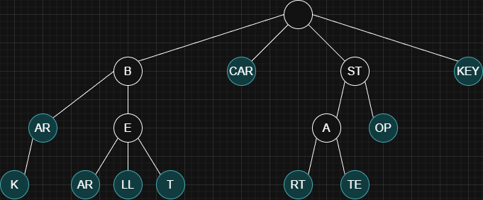

## Overview

A Radix Tree is an optimized version of a [Trie (Prefix Tree)](./trie) that stores strings by combining chains of single-child nodes. Basically, each node can represent a sequence of characters instead of just one.

<Info>
**Use cases**: Autocomplete, IP routing tables, file system paths, dictionary storage, search indexing.
</Info>

<Info>
Trie example for the following words: `bar`, `bark`, `bear`, `bell`, `bet`, `car`, `start`, `state`, `stop`, `key`.

</Info>
